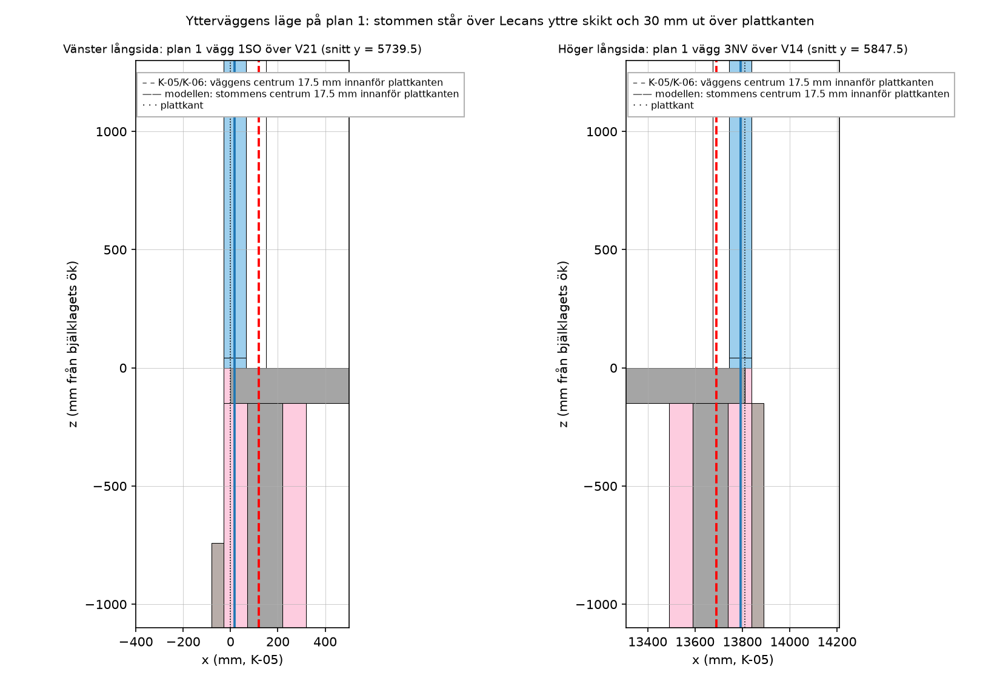

# Lastgeometrin i F-01, K-01, K-05 och K-06 mot Onshape-modellen

Modell: `modeller/trebodar.step`. Handlingar: F-01, K-01, K-02, K-05 och K-06 med beräkningsfilerna i `beräkningar/`. Tabellerna och figuren tas fram av [`kontroll_laster.py`](../kontroll_laster.py), som läser handlingarnas antaganden direkt ur beräkningsfilerna. Mellanbjälklagets geometri (kontur, trapphål, rör, Lecaväggar) kontrolleras av [`kontroll_r031.py`](../kontroll_r031.py).

**Omfattning.** Den geometri som bestämmer lasterna: takvinkel, lastbredder, lastytor, höjder, utsprång, lägen för linjelaster och fyllnadshöjder mot källarväggarna. Stödens exakta lägen under nock- och dalbalkarna ingår inte, eftersom trästommen där inte är fullständigt modellerad. Koordinater som i K-05: x, y från skärningen mellan plattkanterna, z från bjälklagets överkant, mm.

## Sammanfattning

Handlingarnas lastgeometri stämmer med modellen eller ligger på säker sida. Mellanbjälklagets geometri i K-05, K-06 och R-03 är modellens, exakt. Ytterväggarna på plan 1 står över Lecaväggens yttre skikt (figur). Kvar att stämma av:

- **Plattan på mark:** handlingarna förutsätter 400 mm cellplast på fyllning upp till 1,7 m. Modellen är inte uppdaterad där och visar berget 75 mm under plattan.
- **Bottenplattan i matkällaren:** K-06 räknar med bottenplatta i hela källaren. Modellen har ingen platta innanför V2, V15, V19 och V20, bara en remsa under väggarna.
- **Areor:** F-01 anger byggnadsarea 135 + 30 m² och bruttoarea 270 + 30 m² (bygglovet). Modellen ger 160,8 m² för plan 1 och 132,1 m² för källaren, mätt till ytterliv.

Markmodellen är grov (glipor mot berget vid V2/V16 och ingen mark vid V9/V17), så fyllnadshöjderna är en kontroll av storleksordningen.

## Tak (F-01, K-01, K-05)

| Storhet | Handling | Modell | Bedömning |
|---|---|---|---|
| Takvinkel | 30° | 30,00° | stämmer |
| Takbalkar | 45×170 c/c 600 | 45×170, c/c 600 (108 st, glesare vid öppningar) | stämmer |
| Avstånd mellan nockarna (snöbredd dal) | 4,75 m | 4 750 / 4 750 mm | stämmer |
| Lastbredd nockbalk | 2,50 m, största | N3 2,500, N1 2,194, N5 2,194 m | stämmer |
| Lastbredd dalbalk | 2,375 m | 2,375 m | stämmer |
| Nockhöjd | symmetriska huskroppar | mittre nocken 144 mm högre än sidornas, dalarna 125 mm mot sidokropparna | påverkar inte lastbredderna; gavelns topp 0,09 m högre, försumbart |
| Ytterväggens centrum innanför plattkanten | 17,5 mm | 17,5 mm (stommen från 30 mm utanför till 65 mm innanför) | stämmer |
| Väggens höjd till takfot | 2,5 m | 2,49 m | stämmer |
| Takutsprång takfot / gavel | 0,2 / 0,2 m | 0,165 m från plattkanten / 0,03 m | på säker sida |
| Takfotsväggens lastbredd | 1,28 / 1,40 m | 1,25 / 1,38 m | på säker sida |
| Takets planarea, snö på hela taket | 171,6 m², 257 kN | 165,5 m², 248 kN | på säker sida |
| Innertak | 2 × 12,5 gips, 45 reglar | 12 mm gips, 45 mm spalt | på säker sida |
| Takets skikt i K-02 | isolering 170, installationsspalt 45 | 170 mellan takbalkarna, 45 mm spalt | stämmer |

## Vind (F-01, K-01)

| Storhet | Handling | Modell | Bedömning |
|---|---|---|---|
| Referenshöjd z | 7,0 m | cirka 5,5 m (nock 3,98 m och taktäckning över färdigt golv, mark 1,47 m under) | på säker sida |
| e = min(b, 2h), vind längs nocken | 12 m | b = 14,1 m, 2h ≈ 11 m, e ≈ 11 m | på säker sida |

## Bjälklag (K-05, R-03)

| Storhet | Handling | Modell | Bedömning |
|---|---|---|---|
| Plattans area utan trapphål | 157,22 m² | 157,22 m² | stämmer |
| Kontur | 13 810 × 15 900, 12 hörn | samma | stämmer |
| Tjocklek | 150 mm | 150 mm | stämmer |
| Trapphål | 2 070 × 828, hörn (7 348; 5 059,5) | samma | stämmer |
| Rör P1–P19 | modellens lägen | samma | stämmer |
| Lecaväggar V1–V21 | modellens centrumlinjer och ändar | samma | stämmer |
| Plattan på mark | 29,3 m² | samma | stämmer |
| Trappans bredd | 0,83 m | hålets bredd 0,828 m (trappan inte modellerad) | stämmer |

## Källare (K-05, K-06)

| Storhet | Handling | Modell | Bedömning |
|---|---|---|---|
| Fri höjd, rörens längd | 2 100 mm | 2 100 mm, 19 rör | stämmer |
| Lecaväggar | 350 mm, ytterliv 30 mm utanför plattkanten | samma | stämmer |
| Golvyta för nyttig last | 133 m² (359 kN / 2,7) | 111,8 m² innanför väggarna | på säker sida |
| Bottenplatta | 100 mm i hela källaren | ingen platta i matkällaren | stäm av |

## Fyllning mot källarväggarna (K-06), höjd över bottenplattans överkant

| Vägg | K-06 | Modell | Bedömning |
|---|---|---|---|
| V1 | 2,0 m | 1,31–1,56 m fyllning | på säker sida |
| V2 | 2,0 m | 1,51–1,83 m berg | på säker sida |
| V3 | 1,7 m fyllning + 400 mm cellplast | 1,88–2,02 m berg | se plattan på mark |
| V7 | 2,0 m | 1,51 m avsats | på säker sida |
| V9 | 0 → 0,8 m | ingen mark modellerad | kan inte kontrolleras |
| V10–V13 (fasaden med öppningar) | 0,80 m | 0,80 m fyllning | stämmer |
| V14 | 0,8 → 1,8 m | 0,84 → 1,18 m fyllning | på säker sida |
| V16 | 2,0 m | 1,47 m berg | på säker sida |
| V18 | 1,41 → 1,52 m | 1,41 → 1,50 m avsats | stämmer |
| V20 | 1,7 m fyllning + 400 mm cellplast | 1,87 m berg | se plattan på mark |
| V21 | 2,0 m | 0,92–1,39 m fyllning | på säker sida |

## Inte granskat

Stödlägen under nock- och dalbalkarna (trästommen är inte fullständigt modellerad där). Modellens rör är 140 × 140 platshållare; handlingarna har VKR 80×80×4. Lecaväggarnas skikt är i modellen ritade som 100 + 150 + 100 med kärnan i mitten, och tjocklek och läge stämmer med Leca Isoblokk 35.
